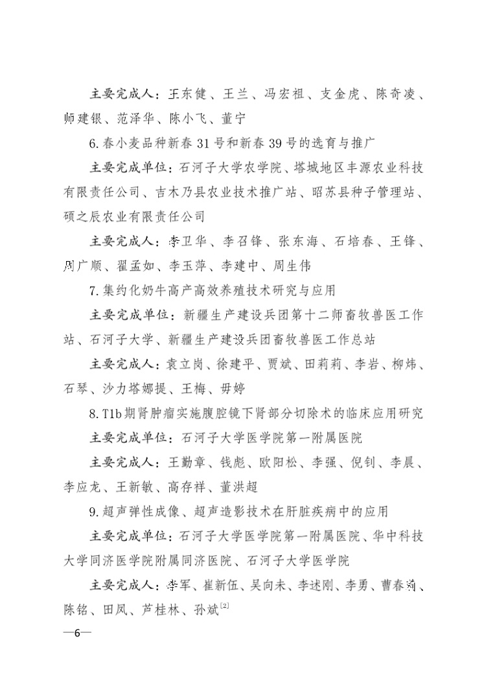

公示网址:[http://kjj.xjbt.gov.cn/c/2019-11-12/7300748.shtml?COLLCC=2095363529&](http://kjj.xjbt.gov.cn/c/2019-11-12/7300748.shtml?COLLCC=2095363529&)

决定网址:[http://kjj.xjbt.gov.cn/c/2019-12-24/7314407.shtml?COLLCC=2095363529&](http://kjj.xjbt.gov.cn/c/2019-12-24/7314407.shtml?COLLCC=2095363529&)

接兵团科技局官方网站最新内容“关于2019年度兵团科学技术奖励的决定”公示，我院泌尿外科荣获兵团科技进步奖二等奖一项，此次兵团科技进步奖共设一等奖5项，二等奖11项，三等奖15项，其中我科获奖题目为“T1b期肾肿瘤实施腹腔镜下肾部分切除术的临床应用研究”，我院副院长、第三师医院院长王勤章教授为第一完成人，特此祝贺。

我院泌尿外科自2011年申报兵团杰出青年基金课题“T1b期肾癌实施腹腔镜下肾部分切除术的临床应用研究”以来，不仅顺利完成了原课题计划设计内容，并且在此基础上不断深入研究创新，解决了以往对于4-7cm的肾肿瘤切除肾脏的技术瓶颈，保留了患者肾脏，改善了患者生存治疗，并且以此制定了相关理论及技术规范并向新疆多家基层医院进行帮扶及技术转换，现将成果汇报如下：

---

* [x] * **应用推广情况**   系统评价了T1b期肾肿瘤行保留肾单位手术的治疗效果后，确定了腹腔镜下肾部分切除术的可行性，统计分析了T1b期肾肿瘤临床、影像学及病理学与腹腔镜下肾部分切除术具体操作相关联的内在规律，并以此制定腹腔镜下肾部分切除术的相关理论和技术操作体系；最后依据所制定的技术操作体系选择T1b期肾肿瘤患者实施腹腔镜下肾部分切除术并向基层医院推广，疗效及远期随访良好。
* [x] **应用产出情况**  通过临床可行性及需求性研究，统计分析了T1b期肾肿瘤流行性病学特点及预后相关影响因素，确定了肿瘤安全切除边距，制定了腹腔镜下肾部分切除术相关理论和技术操作体系，建立了相关手术风险评估系统，与兵团第四师、第五师、第七师、第九师、乌苏市等五家基层医院进行成果转化项目申报，将成果转出，产生了较大的社会效益，本研究共授权专利2项，主编著作1部，发表文章22篇，其中SCI 2篇，中文核心期刊18篇，培养博士研究生3名，硕士研究生7名。
---

