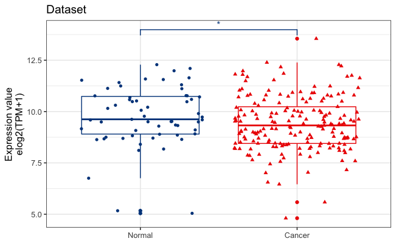
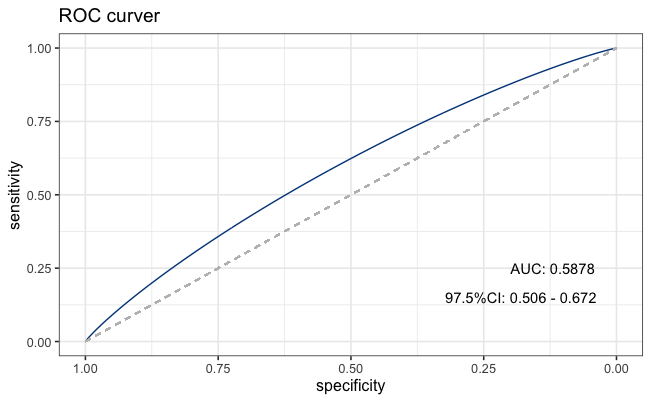
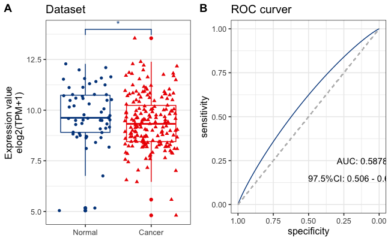

- 比较肿瘤与正常组织的差异,需要进行两独立样本的T检验,可以用boxplot展示,还可以用RCO曲线评估预测性能,那么可以用ggplot2和pROC进行图片构建.
- 首先导入数据,需要类型和数值两列,如下所示:
```{r}
 library(readr)
 data<- read.csv("content/post/2020-08-16-roc/data.csv")
 knitr::kable(data)
```
| Type   | value     |
| ------ | --------- |
| Cancer | 10.005625 |
| Cancer | 7.851749  |
| Cancer | 10.030667 |
| Cancer | 10.79604  |
| Cancer | 9.805744  |
| Normal | 10.210671 |
| Normal | 9.319673  |
| Normal | 8.9128895 |
| Normal | 9.3442955 |
| Normal | 11.58684  |
| Normal | 8.672425  |
| Normal | 10.518653 |
| Normal | 9.902375  |

首先是boxplot,可以用`ggplot2`作图,`ggsignif`进行统计,然后`ggsci`配色,由于默认的X轴排序是按英文来的,如果想固定一个顺序排序,可以把X轴的变量设置为因子,然后定义先后顺序
```{r}
 data<- within(data, Type <- factor(Type, levels = c("Normal", "Cancer"))) 
 shapiro.test(data$value)  # 首先进行正态检验
#	Shapiro-Wilk normality test
#
#data:  data$value
#W = 0.98318, p-value = 0.005502
```
- 可知p<0.05,不符合正态分布,选择非参数检验,默认的就是`非参数检验`,如果大于0.5就改用`t.test`
```{r}
 library(ggplot2)
 library(ggsignif)
 library(ggsci)
 p1<-ggplot(data,aes(x=Type,y=value,color=Type,shape=Type))+ #X轴为类型,Y轴为数值,按类型填色,按类型分形状
   geom_boxplot()+geom_jitter()+#加柱状图,加点
   theme_bw(base_size = 12)+#背景和字体大学
   theme(legend.position = 'none')+#去掉标签
   ggtitle("Dataset")+xlab(NULL)+#添加标题,去掉X轴
   ylab("Expression value\nelog2(TPM+1)")+ #\n表示下一行
   scale_color_lancet()+#lancet配色
   geom_signif(comparisons = list(c("Normal","Cancer")),map_signif_level = T,textsize = 4)#显著标识
 p1
```

接下来是ROC曲线的构建,需要用到`pROC`
```{r}
 library(pROC)
 roc<-roc(data$Type,data$value,ci=TRUE,  smooth = TRUE) #进行roc计算,然后做曲线处理
 roc$ci # 只有2.5,50和97.5%的置信区间,不是95%
# 95% CI: 0.506-0.672 (2000 stratified bootstrap replicates)
 roc$auc #曲线下面积,一般大于0.5最好
# Area under the curve: 0.5878
```
# 画图
```{r}
 p2<-ggroc(roc,color="#00468B")+ggtitle("ROC curver")+
   theme_bw(base_size = 12)+     
  geom_segment(aes(x = 1, xend = 0, y = 0, yend = 1), color="grey",linetype="dashed")+
   ggplot2::annotate('text',x=0.12,y=0.25,label=paste("AUC:",round(roc$auc,4)))+ # 提取ACU结果,四位小数点
   ggplot2::annotate('text',x=0.18,y=0.15,label=paste("97.5%CI:",round(roc$ci[1],4),"-",round(roc$ci[3],4)))# 提取97.5%结果,四位小数点
 p2
```

## 最后,将两张图拼起来
```{r}
 cowplot::plot_grid(p1,p2,labels = "AUTO")
```
